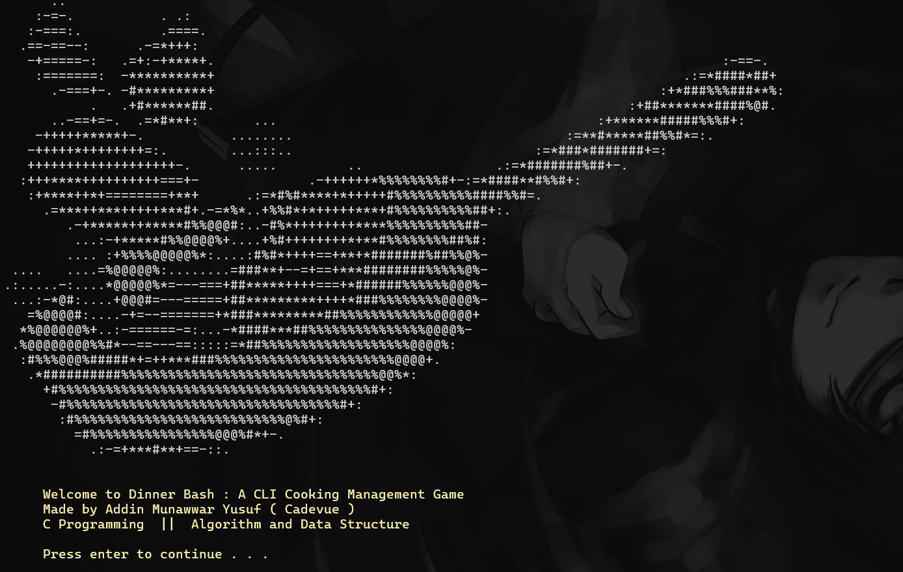
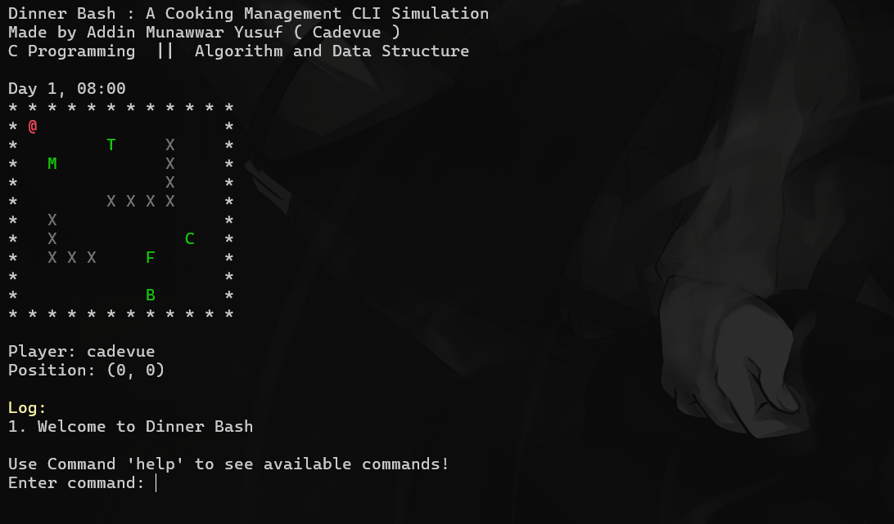
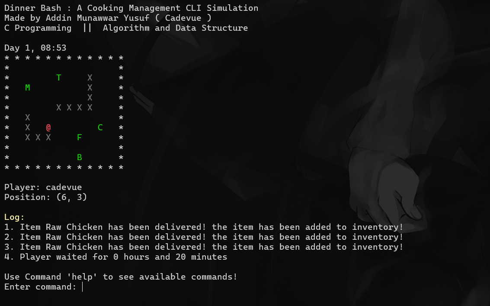
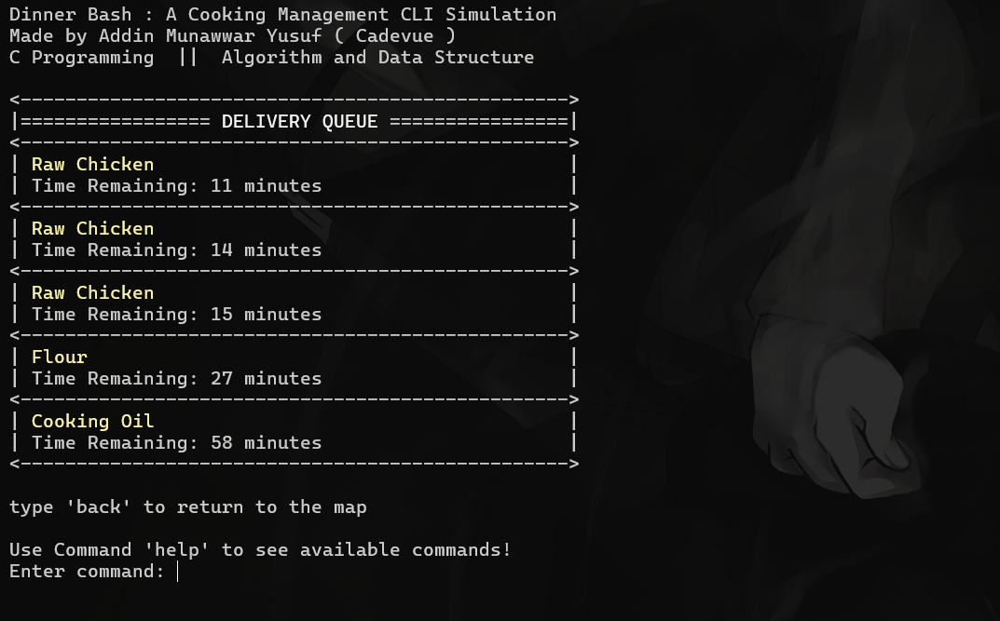

<h1 align="center">Dinner Bash 👨‍🍳 A CLI Cooking Management Game</h1>

> This project is part of my CS202 Challenge. More details about it on [my website](https://cadevue.com)! (updated soon)

# 📌 About This Project 
This program is part of my Computer Science Study at Bandung Institute of Technology. The specific course related to this project is IF2110 Algorithm and Data Structure. The full specification of the project is available at the [docs folder](docs/Specification.pdf), although it is available in Indonesian only.

This project was originally assigned at the 3rd semester, but I decided to redo the entire project (February 2025) from scratch to improve the code quality and to basically to re-learn C, and of course data structure and algorithm. I could say that this code is much cleaner and more organized than the original one! 😄

I also want to credit the people who contributed in the original project:
- [Brian Kheng](https://github.com/briankheng)
- [Jericho Russel Sebastian](https://github.com/JerichoFletcher)
- [Arleen Chrysantha Gunardi](https://github.com/arleenchr)
- [Hobert Anthony Jonatan](https://github.com/HobertJ)

# 📝 Project Description 
A CLI program implemented in C about a cooking management game! Player can move inside a map and interact with the environment, such as buying ingredients and cooking food. This game has no win condition. This is just simulation that focus on implementation of basic data structure and algorithm, such as:

- **Static List** to store game configurations, such as foods and its recipes (loaded in the beginning of the game).
- **Matrix** to store the map of the game.
- **Priority Queue** (in dynamic manner with **linked list**) to store the player's inventory based on expiration date, and delivery queue based on its arrival time.
- **Tree** to store the recipes of the food.
- **Stack** to store the player's action history, with undo and redo feature.
- **Map** for algorithms in the game, such as checking whether the ingredients are available to cook a certain food.

> All data structures are implemented from scratch, without using library!

# 🧰 Technology Used
The technologies used in this project are:
- **C** language the for game implementation
- **CMake** for the build system
- **GCC** as the compiler

# 🚀 How to Run
### Prerequisites
- GCC Compiler
- CMake
- Makefiles

### Windows
1. Navigate to the project directory
2. Run `.\scripts\build.bat` to compile the program.
3. Run `.\scripts\run.bat` to run the program.

### Other Operating System (Manual Build)
1. Navigate to the project directory
2. Make build directory: `mkdir build`, then navigate to build directory `cd build`
3. Run `cmake ..` to generate the makefiles
4. Run `make` to compile the program

 

*If the build fails, you might have to specify the Makefiles generator (-G). More about it in [CMake Documentation](https://cmake.org/cmake/help/latest/manual/cmake-generators.7.html)*

# 📸 Screenshots 
Here are some screenshots of the dinner bash!

### Splash Screen
 

### Main Gameplay

### Logs in Screen

### Delivery Queue

